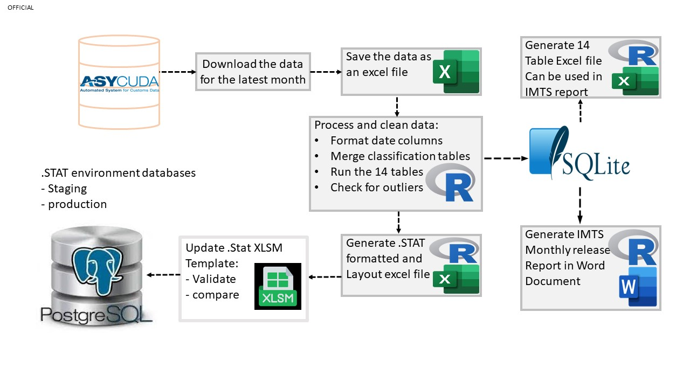

# Tuvalu IMTS Data Processing

 

### Processing the IMTS data to produce the forteen tables

The purpose of this R Reproducible Analytical Pipeline (RAP) is to process the International Merchandise (IMTS) and produce the data needed to be uploaded the SDD .STAT environment for dissemination.

### Diagram showing the stage by stage processes

